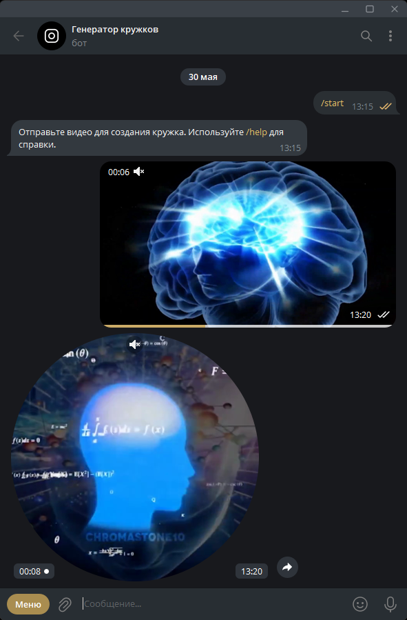

# Telegram Video Note Bot

🤖 Telegram-бот для преобразования видео в видеосообщения (кружки) с автоматической обработкой.

---

## 🖼️ Превью



---

## 🛠 Требования

- **ОС**: Linux (Ubuntu/Debian или аналоги)
- **Python**: 3.11+
- **Зависимости**: FFmpeg
- **API**: Доступ к Telegram API токену ([@BotFather](https://t.me/BotFather))

---

## ⚙️ Установка и настройка

### 1. Подготовка системы
Установите необходимые зависимости:
```bash
sudo apt update
sudo apt install python3-venv ffmpeg -y
```

### 2. Настройка проекта
Клонируйте репозиторий и перейдите в директорию:
```bash
git clone https://github.com/VladislavKrasnov/TelegramRoundBot
cd TelegramRoundBot
```

Создайте и активируйте виртуальное окружение:
```bash
python3 -m venv .venv
source venv/bin/activate
```

Установите Python-зависимости:
```bash
pip install -r requirements.txt
```

### 3. Настройка токена бота
Откройте файл `data/config.py` и добавьте ваш токен:
```python
BOT_TOKEN = "ваш_токен_бота"
```

---

## 🚀 Запуск бота

### Ручной запуск:
```bash
source venv/bin/activate
python main.py
```

### Запуск как системный сервис
Создайте файл сервиса `/etc/systemd/system/TelegramRoundBot.service`:
```ini
[Unit]
Description=Telegram Video Note Bot
After=network.target

[Service]
User=root
WorkingDirectory=/root/TelegramRoundBot
ExecStart=/root/TelegramRoundBot/.venv/bin/python /root/TelegramRoundBot/main.py
Restart=always
RestartSec=10
Environment=PYTHONUNBUFFERED=1

[Install]
WantedBy=multi-user.target
```

Активируйте и запустите сервис:
```bash
sudo systemctl daemon-reload
sudo systemctl enable TelegramRoundBot
sudo systemctl start TelegramRoundBot
```

---

## 📊 Управление и мониторинг

### Команды бота:
| Команда         | Описание                          |
|-----------------|-----------------------------------|
| `/start`        | Начало работы                     |
| `/profile`      | Статистика                        |
| `/change_size`  | Как уменьшить вес видео           |
| `/forward`      | Как переслать кружок от своего имени |
| `/help`         | Справка                           |

### Остановка сервиса:
```bash
sudo systemctl stop TelegramRoundBot
```

---

## 📜 Лицензия
[MIT License](LICENSE.txt)
